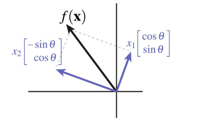

## Spatial Transformation

**Date: 3rd Dec**

#### What is spatial transformation?

  Basically any function that assigns each point a new location.
  
  $$f: R^{n} \rightarrow R^{n}$$
  
#### Applications of linear transformation
  1. position/deform objects in space
  2. move the camera
  3. animate objects over time
  4. project 3D objects onto 2D images
  5. map 2D textures onto 3D objects
  6. projects shadows of 3D objects onto other 3D objects

#### Types of transformation
  1. translation
  2. rotation
  3. scaling
  4. shear

#### New perspective to see transformation

For different transformation, we should focus on invariants preserved during the process.
 
  

#### Rotation

*Keeps origin, distance and orientation*

- **2D Rotation**

  Matrix Representation

$$f_{\theta}(x) = \left[\begin{matrix} cos\theta & -sin\theta \\
                                 sin\theta & cos\theta \end{matrix} \right] \left[ \begin{matrix} x_{1} & x_{2} \end{matrix} \right]^{T}$$
  
  In the above matrix representation, we can treat the first column of $[cos\theta$  $sin\theta]^{T}$ as the basic axis of x-axis $(1,0)$ after transformation, and the second column of $[-sin\theta$ $cos\theta]^{T}$ as the basic axis of y-axis (0,1) after transformation. You can refer to the following figure.
  

- **3D Rotation**

  Based on the above idea, if the object rotate around the z-axis, it means that z-axis keeps unchanged after transformation. The corresponding matrix representation can be like:
  
$$\left[\begin{matrix} cos\theta & -sin\theta & 0 \\
                         sin\theta & cos\theta & 0 \\
                         0 & 0 & 1\end{matrix}  \right]$$

- **Properties of Rotation Matrix**

  1. **Rotation will map standard basis to orthonormal basis $e_{1}, e_{2}, e_{3}:$**
  If let R as the matrix formed by $e_{1}, e_{2}, e_{3}$, each two of them are orthonormal, so $e_{i}^{T}e_{j}=0, (i != j)$
$$R = [e_{1} \quad e_{2} \quad e_{3}]$$

  Then, $$R^{T}R = I$$

  2. **Rotation matrix satisfy $R^{T}R=I$, but satisfying $R^{T}R=I$ does not mean rotation matrix**

     for instance:
     
$$Q = \left[\begin{matrix} -1 & 0 \\ 
                            0 & 1 \end{matrix} \right]$$

$$Q^{T}Q = I$$, but it does not stand rotation transformation, since it fails to preserve orientation. It stands for the transformation of reflection.

#### Orthogonal Transformation

1. Preserve origin and distance
2. transformation matrix meets: $Q^{T}Q=I$
   - *Rotation additionally preserve orientation: $det(Q)>0$*
   - *Reflection reverse orientation: $det(Q)<0$*

#### Scaling
- **Properties**
  1. It is linear transformation.
  2. preserve origin and direction

- **Representation Matrix**

  1. $(u_{1}, u_{2}, u_{3})$ scale by $a$

$$\left[\begin{matrix}a & 0 & 0 \\ 
                      0 & a & 0 \\ 
                      0 & 0 & a \end{matrix} \right]$$

$$\left[\begin{matrix}a & 0 & 0 \\ 
                      0 & b & 0 \\ 
                      0 & 0 & c \end{matrix} \right]$$
                      
                      
  2. negative scale
  
     Negative scaling can be regard as the composition of a sequence of reflections, in this case
     
     - **2D**
     
       In 2D, orientation is preserved. 
     - **3D**

       In 3D, orientation is reversed.

  3. Nonuniform scale
                      
     - **scale along other axes**
     
       The strategy is to rotate the object to the new axes, then scale, finally rotate back.
      
       - **Matrix Representtaion**
      
         $f(x) = R^{T}DRx$  $R$ is the rotation matrix, $D$ is the scaling matrix.

         $A = R^{T}DR$ is the symmetric matrix
         
         *All symmetric matrices represent nonuniform transformation!!!*

     

                      
    
      
       
